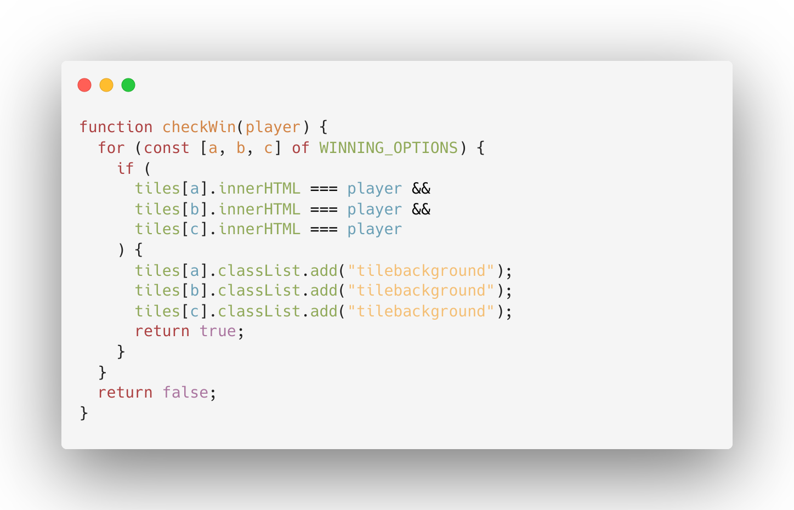

# tic-tac-toe

Try it out: [Link to TicTacToe Game](https://ubiquitous-chebakia-24042d.netlify.app/)

## About

This is one of my first applications I've build.
A TicTacToe application build with **html, css and javascript**.
The player who succeeds in placing three of their marks
in a horizontal, vertical, or diagonal row is the winner.

### Instructions

You can clone the repository and start the application with the Live-Server in you Visual Studio Code.

### CodeSnippets

Definition of all winning options:

Loop through every square(tile) of the the field and check which Player has won

